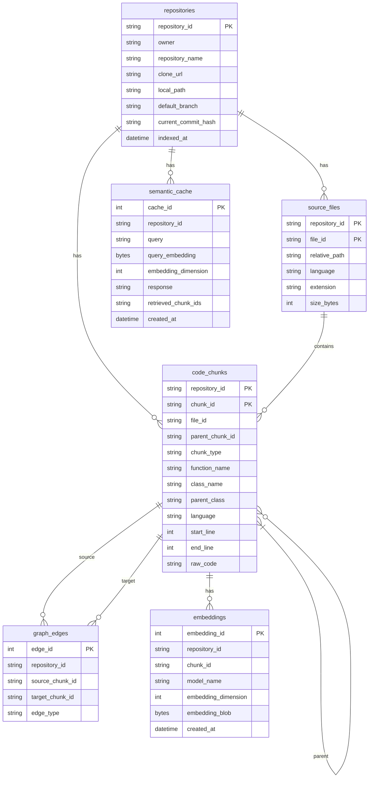

# RepoMind — Complete Architectural Review

> **For senior engineering interviews and deep system mastery.** Every decision explained. Every tradeoff surfaced. Every module traced.

---

## Table of Contents

1. [Project Overview](#1-project-overview)
2. [End-to-End User Flow](#2-end-to-end-user-flow)
3. [Complete Folder Structure](#3-complete-folder-structure)
4. [Architectural Layers](#4-architectural-layers)
5. [Module Dependency Graph](#5-module-dependency-graph)
6. [Complete Request Lifecycle](#6-complete-request-lifecycle)
7. [Data Flow](#7-data-flow)
8. [Configuration](#8-configuration)
9. [Database Design](#9-database-design)
10. [API Documentation](#10-api-documentation)
11. [AI Pipeline](#11-ai-pipeline)
12. [Phase-by-Phase Architecture](#12-phase-by-phase-architecture)
13. [Design Decisions](#13-design-decisions)
14. [Important Classes](#14-important-classes)
15. [Important Algorithms](#15-important-algorithms)
16. [Interview Questions](#16-interview-questions)
17. [Future Improvements](#17-future-improvements)

---

## 1. Project Overview

### Problem Statement

Software engineers frequently need to ask natural-language questions about codebases they don't own or haven't read yet — "How does authentication work?", "What calls the payment processor?", "Does this diff break any tests?". Searching GitHub manually, grepping for function names, or reading thousands of lines of code to answer a single question is slow and error-prone.

### Why RepoMind Exists

RepoMind answers natural-language questions about any public GitHub repository by building a **GraphRAG (Graph-augmented Retrieval-Augmented Generation)** system on top of it. Unlike plain semantic search (which treats code as text) or plain LLM prompting (which hallucinates about code it hasn't read), RepoMind combines:

- **AST-aware chunking** — it understands function/class boundaries, not just arbitrary line windows.
- **Knowledge graph traversal** — it follows call chains, inheritance hierarchies, and import trees, so "How does `login` work?" also retrieves the `authenticate` helper it calls.
- **Hybrid retrieval + reranking** — dense CodeBERT embeddings find semantically similar code; BM25 finds identifier matches; a cross-encoder reranks with joint attention over query+code.
- **Adversarial code review** — the *Adjudicate* subsystem runs an AI prosecutor/defender/judge pipeline against any submitted unified diff.

### Who the Users Are

| User Type | Use Case |
|-----------|----------|
| Software engineers | Understand an unfamiliar codebase before contributing |
| Code reviewers | Understand the blast radius of a proposed change |
| Technical interviewers | Ask deep architecture questions about open-source projects |
| AI researchers | Evaluate retrieval strategies over code (ablation study built-in) |

### High-Level Architecture

```
┌─────────────────────────────────────────────────────┐
│                    CLIENTS                          │
│  React Frontend  │  Streamlit UI  │  CLI  │ Scripts │
└──────────┬────────────────────────────────────┬─────┘
           │ HTTP (REST + SSE)                  │ Python import
           ▼                                    ▼
┌─────────────────────────────────────────────────────┐
│              FastAPI Backend (api/main.py)           │
│  /repos/index  /query  /search  /context  /review   │
└───────────────────────┬─────────────────────────────┘
                        │ delegates to
                        ▼
┌─────────────────────────────────────────────────────┐
│              Pipeline (pipeline.py)                  │
│   Orchestrates ALL backend phases end-to-end         │
└──┬──────────────┬──────────────┬────────────────────┘
   │              │              │
   ▼              ▼              ▼
Ingestion      Retrieval     Generation
   │              │              │
   ▼              ▼              ▼
Database       Graph          Adjudicate
(SQLite +    (NetworkX        (Adversarial
 FAISS +      DiGraph)         Review)
 BM25)
```

### Main Features

| Feature | Description |
|---------|-------------|
| **Repository Indexing** | Clones a GitHub repo, AST-parses Python/JS, chunks, graphs, embeds, indexes |
| **Natural-Language Q&A** | Hybrid retrieval + graph expansion + reranking + LLM generation |
| **Semantic Caching** | Near-duplicate questions served from cache, skipping retrieval + LLM |
| **Graph Visualization** | Interactive call graph rendered in React (or Streamlit) |
| **Adversarial Code Review** | Diff → Context → Defender → Prosecutor → Verifier → Judge → Verdict |
| **Blast Radius** | Given any function, find all nodes within N hops in the call graph |
| **Ablation Study** | Toggle every retrieval strategy independently for benchmarking |

### Technologies and Why Each Was Chosen

| Technology | Role | Why Selected Over Alternatives |
|------------|------|-------------------------------|
| **Python** | Backend runtime | Native ML ecosystem (PyTorch, sentence-transformers, FAISS) |
| **FastAPI** | HTTP API | Async-first, Pydantic-native, auto OpenAPI docs. Flask lacks async; Django is too heavy |
| **Streamlit** | Legacy UI (pre-React) | Rapid prototyping for ML UIs. Now a thin client over FastAPI |
| **React + Vite** | Production frontend | Component model for complex streaming UI (SSE review panel). Vite for fast HMR |
| **Tree-sitter** | AST parsing | Language-agnostic, battle-tested, incremental. `ast` module only handles Python; `esprima` JS-only |
| **NetworkX** | Knowledge graph | In-process directed graph with full traversal API. No Neo4j deployment required |
| **FAISS** | Dense vector index | Sub-millisecond ANN search from Meta. Qdrant/Pinecone require a server |
| **BM25 (rank-bm25)** | Sparse retrieval | Classic TF-IDF variant, extremely fast, handles identifier-heavy queries that embeddings compress away |
| **Sentence-Transformers** | Embeddings + reranking | `microsoft/codebert-base` for code embeddings; cross-encoder for reranking |
| **SQLite + SQLAlchemy** | Structured persistence | Zero-deployment, portable, sufficient for per-repository data at this scale |
| **Pydantic-Settings** | Configuration | Typed, validated, `.env`-aware. Fails fast on bad config instead of at runtime |
| **Gemini / Groq / Ollama** | LLM generation | Priority chain: Gemini (best quality) → Groq (quota fallback) → Ollama (fully local) |
| **Docker** | Containerization | `git` dependency installed system-level; repeatable environment |

### Design Philosophy

1. **No retrieval logic in the HTTP layer.** `api/main.py` delegates everything to `Pipeline`; it contains zero retrieval or generation logic.
2. **No LLM calls except in `generation/llm_client.py`.** Every provider SDK is imported only there. No google-genai import anywhere else.
3. **Fail fast with typed exceptions.** Every cross-boundary failure is caught and re-raised as a `RepoMindError` subclass — never a raw `SQLAlchemyError` or `transformers` exception.
4. **Feature flags for every retrieval strategy.** `USE_BM25`, `USE_GRAPH_EXPANSION`, `USE_RERANKER`, `USE_SMALL_TO_BIG`, `USE_SEMANTIC_CACHE` can each be toggled independently, enabling fair A/B benchmarking.
5. **Deterministic IDs everywhere.** `chunk_id`, `file_id`, and `repository_id` are all UUID5s derived from stable inputs — re-indexing the same repo hits the same rows, never creates duplicates.

---

## 2. End-to-End User Flow

### Indexing Flow

```
User submits GitHub URL
          │
          ▼
React Frontend (POST /repos/index)
          │
          ▼
FastAPI: api/main.py → validate_github_url()
          │  computes deterministic repo_id
          ▼
Background task: _run_indexing(repo_id, url)
          │
          ▼
Pipeline.index_repository(url, on_progress)
          │
    ┌─────┼────────────────────────────┐
    ▼     ▼                            ▼
RepositoryManager  FileDiscovery   TreeSitterParser
(git clone)        (walk .py/.js)  (AST → CodeChunks)
    │              │                   │
    └──────────────┴───────────────────┘
                   │
                   ▼
         SemanticChunker
         (adds sliding + parent chunks)
                   │
                   ▼
         DatabaseManager.store_*()
         (SQLite: repositories, source_files, code_chunks)
                   │
                   ▼
         RepositoryGraphBuilder.build_graph()
         (NetworkX DiGraph: call/inherit/import edges)
                   │
                   ▼
         save_graph() → JSON file on disk
                   │
                   ▼
         EmbeddingManager.generate_embeddings()
         (CodeBERT → float32 blobs in SQLite embeddings table)
                   │
                   ▼
         FaissIndexManager.build_index() + save_index()
         BM25Manager.build_index() + save_index()
                   │
                   ▼
         IndexingSummary returned → status="ready"
                   │
                   ▼
Frontend polls GET /repos/{repo_id}/status
→ displays stats (files, chunks, graph nodes/edges)
```

### Query Flow

```
User types question → clicks "Ask RepoMind"
          │
          ▼
React Frontend (POST /repos/{repo_id}/query)
          │
          ▼
FastAPI: query_repository() → _require_ready(repo_id)
          │
          ▼
Pipeline.query(question, repo_id)
          │
    ┌─────┼───────────────────────────────────────┐
    │     │                                       │
    ▼     ▼                                       │
SemanticCacheManager.lookup()           ←── cache hit?
    │                                       │
    │ (miss)                                │ (hit)
    ▼                                       ▼
EmbeddingManager.encode(query)      Return cached answer
    │                               (skip retrieval + LLM)
    ▼
FaissIndexManager.search() → top 20 dense results
BM25Manager.search() → top 20 sparse results
    │
    ▼
HybridRetriever._fuse() via RRF
(Reciprocal Rank Fusion: 1/(k+rank) per list)
    │
    ▼
GraphExpander.expand()
(1-hop: callers, callees, inheritance, imports)
    │
    ▼
CrossEncoderReranker.rerank()
(cross-encoder scores (query, raw_code) pairs jointly)
    │
    ▼
ContextBuilder.build_context()
(small-to-big substitution, dedup, token budget)
    │
    ▼
LLMService.generate_answer()
(LLMClient.complete(system_prompt, user_prompt))
    │
    ▼
SemanticCacheManager.store() ← stores result for future
    │
    ▼
AskResult { answer, citations, cache_hit, latency_ms }
    │
    ▼
QueryResponse JSON → Frontend renders answer + citations
```

### Adversarial Review Flow (Adjudicate)

```
User pastes unified diff → clicks "Review"
          │
          ▼
React Frontend: fetch POST /repos/{repo_id}/review
(reads response as ReadableStream, not EventSource)
          │
          ▼
FastAPI: review_repository() → StreamingResponse (SSE)
          │
          ▼
run_live_review() → yields events as each stage completes:

Stage 1: AdjudicateContextBuilder.build(diff)
   - Parses diff hunk headers → changed file:line pairs
   - GET /repos/{repo_id}/context for each changed location
   - GET /repos/{repo_id}/graph for callers/callees
   - GET /repos/{repo_id}/search for related tests
   → yields {"type": "context", "changed_functions": [...]}

Stage 2: DefenderAgent.draft_justification()
   → LLM call: "Justify this change"
   → yields {"type": "defender", "justification": "..."}

Stage 3: ProsecutorAgent.raise_concerns()
   → LLM call (structured JSON): list of ProsecutorClaims
   → yields {"type": "claims", "claims": [...]}

Stage 4: For each claim → verify_claim()
   - Strategy 1: run proposed test in sandbox subprocess
   - Strategy 2: static analysis / type check
   - Strategy 3: LLM judgment
   → yields {"type": "claim_verified", "status": "...", "confidence": "..."}

Stage 5: Rebuttal loop (max 3 rounds)
   → DefenderAgent.rebut() per round
   → yields {"type": "rebuttal", "round": N, "text": "..."}

Stage 6: JudgeAgent.judge()
   → LLM call (structured JSON): JudgeVerdict
   → mechanically enforced: cap+INCONCLUSIVE → minority_report required
   → yields {"type": "judge", "verdict": "approve/reject/needs_human_review"}

Stage 7: → yields {"type": "done"}
```

---

## 3. Complete Folder Structure

```
RepoMind/
├── app.py                    ← Streamlit entrypoint (legacy UI)
├── pipeline.py               ← Master orchestrator (no domain logic)
├── config.py                 ← Single Settings instance, all config
├── cli.py                    ← Command-line interface
├── Dockerfile
├── docker-compose.yml
├── requirements.txt
├── pytest.ini
├── Makefile
│
├── api/                      ← HTTP presentation layer
│   ├── __init__.py
│   └── main.py               ← FastAPI app, all endpoints
│
├── core/                     ← Shared primitives (no business logic)
│   ├── constants.py          ← Static values: model names, dir names
│   ├── exceptions.py         ← RepoMindError hierarchy
│   └── logging.py            ← get_logger() factory
│
├── models/                   ← Shared dataclasses across layers
│   └── schemas.py            ← CodeChunk, RetrievedChunk, GeneratedAnswer, etc.
│
├── ingestion/                ← Phase 1-5: repository → chunks
│   ├── repository_manager.py ← Git clone/cache
│   ├── file_discovery.py     ← Walk repo, filter by extension
│   ├── ast_parser.py         ← Tree-sitter → CodeChunks
│   ├── chunker.py            ← Sliding + parent chunks
│   ├── deterministic_ids.py  ← UUID5 computation
│   ├── git_client.py         ← GitPython wrapper
│   ├── repository_metadata.py← RepositoryMetadata dataclass
│   ├── source_file.py        ← SourceFile dataclass
│   └── validators.py         ← GitHub URL validation
│
├── graph/                    ← Phase 6: knowledge graph
│   ├── graph_builder.py      ← RepositoryGraphBuilder
│   ├── call_extractor.py     ← Extract call sites from code
│   ├── import_extractor.py   ← Extract import statements
│   ├── blast_radius.py       ← N-hop subgraph from a focal node
│   └── graph_queries.py      ← Graph utility queries
│
├── database/                 ← Phase 7-8: persistence
│   ├── models.py             ← SQLAlchemy ORM models
│   ├── sqlite_client.py      ← DatabaseManager (all reads/writes)
│   ├── vector_store.py       ← FaissIndexManager
│   └── graph_store.py        ← save_graph/load_graph (JSON)
│
├── embedding/                ← Phase 8: embeddings
│   ├── embedding_manager.py  ← Batch-encode chunks, store in SQLite
│   └── model_loader.py       ← Load CodeBERT / alternative model
│
├── retrieval/                ← Phases 9-14: retrieval pipeline
│   ├── hybrid_retriever.py   ← RRF fusion of FAISS + BM25
│   ├── graph_retriever.py    ← GraphExpander (1-hop neighbor expansion)
│   ├── sparse_retriever.py   ← BM25Manager
│   ├── dense_retriever.py    ← (thin wrapper, FAISS lives in database/)
│   ├── reranker.py           ← CrossEncoderReranker
│   ├── semantic_cache.py     ← SemanticCacheManager
│   └── tokenizer.py          ← Token counting utilities
│
├── generation/               ← Phases 15-16: context + LLM
│   ├── context_builder.py    ← ContextBuilder (small-to-big, budget)
│   ├── answer_generator.py   ← LLMService (prompt → answer → cache)
│   └── llm_client.py         ← LLMClient (Gemini/Groq/Ollama)
│
├── adjudicate/               ← Phases 24-31: adversarial review
│   ├── context_builder.py    ← AdjudicateContextBuilder
│   ├── repomind_client.py    ← HTTP client to call back the API
│   ├── schemas.py            ← ProsecutorClaim, JudgeVerdict, etc.
│   ├── config.py             ← Per-agent model overrides
│   ├── agents/
│   │   ├── defender.py       ← DefenderAgent
│   │   ├── prosecutor.py     ← ProsecutorAgent
│   │   ├── judge.py          ← JudgeAgent
│   │   └── base.py           ← Shared agent base
│   ├── orchestrator/
│   │   ├── live_review.py    ← run_live_review() → SSE events
│   │   └── rebuttal_loop.py  ← Termination logic
│   └── verifier/
│       ├── verifier.py       ← verify_claim() dispatcher
│       ├── strategies.py     ← Subprocess / static / LLM strategies
│       ├── sandbox.py        ← Temp dir materialization
│       └── models.py         ← VerificationResult dataclass
│
├── evaluation/               ← Phase 17: benchmarking
│   ├── ablation.py           ← Systematically toggle feature flags
│   ├── retrieval_eval.py     ← Precision/recall metrics
│   ├── ragas_eval.py         ← RAGAS integration (optional)
│   ├── metrics.py            ← MRR, NDCG, Hit@K
│   └── visualization.py     ← Matplotlib charts
│
├── frontend/                 ← Phase 32: React UI
│   ├── src/
│   │   ├── App.jsx
│   │   ├── main.jsx
│   │   ├── api/client.js     ← All fetch calls to FastAPI
│   │   ├── components/
│   │   │   ├── Chat/         ← Q&A panel + citations
│   │   │   ├── Graph/        ← Interactive call graph
│   │   │   ├── Review/       ← Diff input + SSE streaming panel
│   │   │   ├── Sidebar/      ← Repository info + feature toggles
│   │   │   └── Layout/       ← App shell, navigation
│   │   ├── hooks/            ← Custom React hooks
│   │   ├── state/            ← State management
│   │   └── styles/           ← CSS modules
│   ├── vite.config.js
│   └── tailwind.config.js
│
├── prompts/                  ← Prompt templates (minimal, agents own their prompts)
│   └── templates.py
│
├── scripts/
│   └── demo_phase16_end_to_end.py  ← Standalone demo script
│
├── tests/
│   ├── test_pipeline.py
│   ├── test_config.py
│   ├── test_adjudicate/
│   ├── test_core/
│   ├── test_database/
│   ├── test_embedding/
│   ├── test_evaluation/
│   ├── test_generation/
│   ├── test_graph/
│   ├── test_ingestion/
│   ├── test_models/
│   ├── test_retrieval/
│   └── test_utils/
│
├── data/                     ← Runtime data (gitignored)
│   ├── repositories/         ← Cloned repos
│   ├── indexes/              ← FAISS + BM25 index files
│   ├── sqlite/repomind.db    ← Main database
│   ├── cache/                ← Semantic cache (embedded in SQLite)
│   ├── graph/                ← Per-repo graph JSON files
│   └── logs/
│
└── ui/                       ← Streamlit-specific UI helpers
    ├── api_client.py         ← httpx-based client for Streamlit
    ├── components.py         ← Streamlit widget wrappers
    └── graph_view.py         ← streamlit-agraph integration
```

### Key File Responsibilities

| File | Purpose | Called By | Calls |
|------|---------|-----------|-------|
| `pipeline.py` | Master orchestrator, sequences all phases | `api/main.py`, `cli.py`, `app.py` | All backend modules |
| `api/main.py` | HTTP presentation, no business logic | React frontend, Streamlit UI | `pipeline.py`, `database/`, `generation/`, `adjudicate/` |
| `config.py` | Singleton `settings` object | Every module | `core/constants.py` |
| `models/schemas.py` | Shared frozen dataclasses | Every layer | Nothing (leaf module) |
| `core/exceptions.py` | Exception hierarchy | Every module | Nothing (leaf) |
| `ingestion/ast_parser.py` | Tree-sitter → `CodeChunk` | `pipeline.py` | `models/schemas.py`, `ingestion/deterministic_ids.py` |
| `ingestion/chunker.py` | Sliding + parent chunks | `pipeline.py` | `models/schemas.py` |
| `graph/graph_builder.py` | `nx.DiGraph` from chunks+files | `pipeline.py` | `graph/call_extractor.py`, `graph/import_extractor.py` |
| `database/sqlite_client.py` | All SQLite reads/writes | `pipeline.py`, `api/main.py`, `adjudicate/` | `database/models.py`, `models/schemas.py` |
| `database/vector_store.py` | FAISS index lifecycle | `pipeline.py`, `retrieval/` | `database/sqlite_client.py` |
| `retrieval/hybrid_retriever.py` | RRF fusion | `pipeline.py` | `database/vector_store.py`, `retrieval/sparse_retriever.py` |
| `retrieval/graph_retriever.py` | 1-hop graph expansion | `pipeline.py` | `database/graph_store.py`, `database/sqlite_client.py` |
| `retrieval/reranker.py` | Cross-encoder reranking | `pipeline.py` | `sentence_transformers.CrossEncoder` |
| `retrieval/semantic_cache.py` | Query similarity cache | `pipeline.py` | `database/sqlite_client.py`, `embedding/model_loader.py` |
| `generation/context_builder.py` | Assemble LLM context string | `pipeline.py`, `api/main.py` | `database/sqlite_client.py`, `models/schemas.py` |
| `generation/llm_client.py` | ALL LLM provider calls | `generation/answer_generator.py`, `adjudicate/agents/` | `google.genai`, `groq`, `ollama` SDKs |
| `adjudicate/orchestrator/live_review.py` | SSE pipeline orchestration | `api/main.py` | All adjudicate agents + verifier |

---

## 4. Architectural Layers

```
┌──────────────────────────────────────────────────────────────┐
│  PRESENTATION LAYER                                          │
│  React Frontend (Vite) │ Streamlit UI │ CLI                  │
│  Responsibility: render UI, call API, stream SSE events      │
└───────────────────────────┬──────────────────────────────────┘
                            │ HTTP
┌───────────────────────────▼──────────────────────────────────┐
│  API LAYER                                                   │
│  api/main.py (FastAPI)                                       │
│  Responsibility: validate requests, route to Pipeline,       │
│  serialize responses, handle CORS + timeouts                 │
│  No business logic — pure HTTP orchestration                 │
└───────────────────────────┬──────────────────────────────────┘
                            │ Python function calls
┌───────────────────────────▼──────────────────────────────────┐
│  ORCHESTRATION LAYER                                         │
│  pipeline.py (Pipeline class)                                │
│  Responsibility: wire all phases, manage lazy-loaded         │
│  resources (embedding model, reranker, FAISS/BM25 indexes)   │
│  No domain logic — pure sequencing + resource management     │
└──┬─────────────────┬──────────────────┬─────────────────────┘
   │                 │                  │
   ▼                 ▼                  ▼
┌──────────┐  ┌────────────┐  ┌────────────────────┐
│INGESTION │  │ RETRIEVAL  │  │ GENERATION         │
│LAYER     │  │ LAYER      │  │ LAYER              │
│          │  │            │  │                    │
│ingestion/│  │retrieval/  │  │generation/         │
│graph/    │  │            │  │                    │
│          │  │            │  │                    │
│Resp:     │  │Resp:       │  │Resp:               │
│Parse code│  │Find chunks │  │Build context,      │
│Build graph  │relevant to │  │call LLM, cache     │
│Chunk code│  │a query     │  │results             │
└────┬─────┘  └─────┬──────┘  └────────┬───────────┘
     │               │                  │
     └───────────────┼──────────────────┘
                     ▼
┌──────────────────────────────────────────────────────────────┐
│  PERSISTENCE LAYER                                           │
│  database/ (SQLite + FAISS + BM25 + JSON graph)              │
│  Responsibility: durably store/retrieve all indexed data      │
│  No business logic — pure read/write with transactions        │
└──────────────────────────────────────────────────────────────┘
                     │
                     ▼
┌──────────────────────────────────────────────────────────────┐
│  AI SERVICES LAYER                                           │
│  generation/llm_client.py, embedding/model_loader.py,        │
│  retrieval/reranker.py                                       │
│  Responsibility: isolate all third-party ML/API calls        │
│  Exception boundary: converts provider errors → RepoMindError│
└──────────────────────────────────────────────────────────────┘
```

### Layer Communication

| From | To | Protocol |
|------|----|---------|
| Presentation | API | HTTP/REST + Server-Sent Events |
| API | Orchestration | Direct Python calls (`Pipeline` singleton) |
| Orchestration | Ingestion/Retrieval/Generation | Direct Python calls |
| Ingestion/Retrieval/Generation | Persistence | `DatabaseManager` methods |
| Generation | AI Services | `LLMClient.complete()` |
| Retrieval | AI Services | `CrossEncoderReranker.rerank()`, FAISS |
| Adjudicate | API (self) | Real HTTP back to localhost (RepoMindClient) |

### Why This Separation Was Chosen

- **API has no retrieval logic**: Makes the API swappable (replace FastAPI with gRPC without touching `Pipeline`)
- **`Pipeline` has no domain logic**: All logic lives in the phase modules it sequences, making each phase independently testable
- **AI services isolated in leaf modules**: Swapping Gemini for Groq touches only `llm_client.py`, not every caller
- **Persistence behind `DatabaseManager`**: Switching from SQLite to PostgreSQL touches only `sqlite_client.py` and `models.py`

---

## 5. Module Dependency Graph

```mermaid
graph TD
    api["api/main.py"] --> pipeline["pipeline.py"]
    api --> adjudicate_orchestrator["adjudicate/orchestrator/live_review.py"]
    api --> database_client["database/sqlite_client.py"]
    api --> gen_context["generation/context_builder.py"]

    pipeline --> ingestion["ingestion/*"]
    pipeline --> graph_builder["graph/graph_builder.py"]
    pipeline --> database_client
    pipeline --> database_vector["database/vector_store.py"]
    pipeline --> embedding["embedding/embedding_manager.py"]
    pipeline --> retrieval_hybrid["retrieval/hybrid_retriever.py"]
    pipeline --> retrieval_graph["retrieval/graph_retriever.py"]
    pipeline --> retrieval_reranker["retrieval/reranker.py"]
    pipeline --> retrieval_cache["retrieval/semantic_cache.py"]
    pipeline --> gen_context
    pipeline --> gen_answer["generation/answer_generator.py"]
    pipeline --> retrieval_sparse["retrieval/sparse_retriever.py"]

    ingestion --> models["models/schemas.py"]
    ingestion --> core["core/*"]

    graph_builder --> ingestion
    graph_builder --> models

    database_client --> database_models["database/models.py"]
    database_client --> models
    database_client --> ingestion

    database_vector --> database_client
    database_vector --> models

    embedding --> database_client
    embedding --> model_loader["embedding/model_loader.py"]

    retrieval_hybrid --> database_vector
    retrieval_hybrid --> retrieval_sparse
    retrieval_hybrid --> models

    retrieval_graph --> database_client
    retrieval_graph --> database_graphstore["database/graph_store.py"]
    retrieval_graph --> models

    retrieval_reranker --> models

    retrieval_cache --> database_client
    retrieval_cache --> model_loader
    retrieval_cache --> models

    gen_context --> database_client
    gen_context --> models

    gen_answer --> gen_context
    gen_answer --> llm_client["generation/llm_client.py"]
    gen_answer --> retrieval_cache
    gen_answer --> models

    llm_client --> core

    adjudicate_orchestrator --> adjudicate_agents["adjudicate/agents/*"]
    adjudicate_orchestrator --> adjudicate_context["adjudicate/context_builder.py"]
    adjudicate_orchestrator --> adjudicate_verifier["adjudicate/verifier/*"]

    adjudicate_context --> repomind_client["adjudicate/repomind_client.py"]
    adjudicate_agents --> llm_client
    adjudicate_verifier --> adjudicate_agents

    config["config.py"] --> core

    style models fill:#e1f5fe
    style core fill:#f3e5f5
    style config fill:#fff9c4
    style llm_client fill:#fce4ec
```



### Circular Dependency Avoidance

The design intentionally prevents circular imports by having a **strict layering rule**:

- `models/schemas.py` imports **nothing** from the project (leaf node)
- `core/` imports **nothing** from the project
- `ingestion/` imports only `models/` and `core/`
- `graph/` imports `ingestion/` and `models/`
- `database/` imports `ingestion/`, `models/`, `core/`
- `embedding/` imports `database/`
- `retrieval/` imports `database/`, `embedding/`, `models/`
- `generation/` imports `retrieval/`, `database/`, `models/`
- `adjudicate/` imports `generation/`, but NOT `pipeline.py` directly
- `pipeline.py` imports everything — it's the only module that knows all layers
- `api/main.py` imports `pipeline.py` and individual modules for endpoints it needs direct access to

The `adjudicate/` → `api/` "loop" is broken by having adjudicate call back over HTTP (localhost) instead of importing `api/main.py` directly — explicitly acknowledged in `live_review.py`'s docstring.

---

## 6. Complete Request Lifecycle

**Scenario:** User asks "How does the authentication flow work?" against an already-indexed repository.

```
1. User types query in React Chat component
   File: frontend/src/components/Chat/

2. React submits POST /repos/{repo_id}/query
   File: frontend/src/api/client.js
   Body: {"question": "How does the authentication flow work?"}

3. FastAPI receives request
   File: api/main.py → query_repository()
   → _require_ready(repo_id) checks _index_state dict
   → run_in_threadpool() wraps sync Pipeline call
   → asyncio.wait_for() sets 120s timeout

4. Pipeline.query(question, repo_id)
   File: pipeline.py → Pipeline.query()
   → _get_semantic_cache() (lazy init SemanticCacheManager)

5. SemanticCacheManager.lookup(repository_id, query)
   File: retrieval/semantic_cache.py
   → embed the query with CodeBERT
   → load all cache entries for this repository from SQLite
   → compute cosine similarity against all cached query embeddings
   → if similarity >= 0.95 AND _is_lexically_compatible():
       return cached answer (skip steps 6-13)

6. Pipeline._embed_query(query)
   File: pipeline.py → embedding/model_loader.py
   → model.encode([query]) → numpy array [768 dims]

7. FaissIndexManager.search(query_embedding, top_k=20)
   File: database/vector_store.py
   → index.search(query_embedding, 20)
   → returns 20 chunk_ids with cosine similarity scores

8. BM25Manager.search(query, top_k=20)
   File: retrieval/sparse_retriever.py
   → tokenize query → BM25 scores against all chunk texts
   → returns 20 chunk_ids with BM25 scores

9. HybridRetriever._fuse(dense_results, sparse_results)
   File: retrieval/hybrid_retriever.py
   → for each rank in dense list: score += 1/(60 + rank)
   → for each rank in sparse list: score += 1/(60 + rank)
   → sort by fused_score descending → up to top_k=8 chunks

10. GraphExpander.expand(repository_id, retrieved_chunks)
    File: retrieval/graph_retriever.py
    → load_graph(owner_name.json) from GRAPH_DIR
    → for each retrieved chunk: find in_edges + out_edges
    → also follow file-level "imports" edges
    → new neighbors get score = originating_score * 0.5
    → returns original chunks + neighbors, sorted: distance=0 first

11. CrossEncoderReranker.rerank(query, candidates, top_k=8)
    File: retrieval/reranker.py
    → cross_encoder.predict([(query, chunk.raw_code), ...])
    → joint attention over query+code (unlike bi-encoder)
    → returns top 8 RankedChunks by cross_encoder_score

12. ContextBuilder.build_context(repository_id, query, ranked)
    File: generation/context_builder.py
    → for each RankedChunk: if parent_chunk_id exists → substitute parent
    → deduplicate (two methods of same class → one parent block)
    → estimate token count per block (len(text)/4)
    → keep blocks until cumulative > MAX_CONTEXT_TOKENS (4000)
    → format: "File: auth.py, Function: login_user\n```python\n...\n```"
    → returns ContextDocument { context, included_chunks, chunk_citations }

13. LLMService.generate_answer(repository_id, query, context_document)
    File: generation/answer_generator.py
    → build system_prompt (role instructions)
    → build user_prompt = context_document.context + "\n\nQuestion: " + query
    → LLMClient.complete(system_prompt, user_prompt)
        File: generation/llm_client.py
        → if USE_GEMINI: gemini.models.generate_content(...)
        → returns LLMCompletion { text, tokens, model_name }
    → match_citations(): find which file/function names the LLM mentioned
    → SemanticCacheManager.store(repo_id, query, answer, chunk_ids)
    → returns GeneratedAnswer

14. Pipeline._build_citations(chunk_ids, chunk_map, ranked_by_id)
    File: pipeline.py
    → for each cited chunk_id: build CitationDisplay
    → CitationDisplay { chunk_id, file_path, function_name, retrieval_source, score, raw_code }

15. AskResult assembled:
    { answer, citations, retrieved_count, graph_expanded_count, cache_hit=False, llm_model, retrieval_latency_ms }

16. api/main.py serializes to QueryResponse JSON

17. React renders answer + citations with source attribution
    File: frontend/src/components/Chat/
```

**Total call stack depth**: 17 layers from user click to rendered response.

---

## 7. Data Flow

### Ingestion Data Flow

```
GitHub URL (str)
    │
    ▼ ingestion/repository_manager.py
RepositoryMetadata { owner, name, local_path, commit_hash, clone_url }
    │
    ▼ ingestion/file_discovery.py
[SourceFile { relative_path, absolute_path, language, extension, size_bytes }]
    │
    ▼ ingestion/ast_parser.py (TreeSitterParser)
    │   Input:  SourceFile
    │   Processing: Tree-sitter parse → walk AST → extract nodes by type
    │   Internal: _ExtractedNode { chunk_type, function_name, class_name, span_node }
    │   Output: [CodeChunk (UUID4 for chunk_id at this stage)]
    │
    ▼ ingestion/chunker.py (SemanticChunker)
    │   Input:  SourceFile + [CodeChunk (AST)]
    │   Processing: sliding windows + parent context windows
    │   Output: ChunkingResult { ast_chunks (with parent_chunk_id set), sliding_chunks, parent_chunks }
    │
    ▼ database/sqlite_client.py (store phase)
    │   Writes: RepositoryRecord, SourceFileRecord, [CodeChunkRecord] to SQLite
    │
    ▼ graph/graph_builder.py (RepositoryGraphBuilder)
    │   Input:  [SourceFile] + [CodeChunk (AST only)]
    │   Processing: _SymbolTable (name → chunk_id index)
    │             → containment edges (Class → Method)
    │             → inheritance edges (Child → Parent)
    │             → call edges (caller → callee, name-resolved)
    │             → import edges (File → File)
    │   Output: nx.DiGraph { nodes: files + chunks, edges: typed relationships }
    │
    ▼ database/graph_store.py
    │   Writes: DiGraph as node_link JSON to GRAPH_DIR/{owner}_{name}.json
    │   Also: sqlite_client.store_graph() → GraphEdgeRecord rows (lossy, chunk-to-chunk only)
    │
    ▼ embedding/embedding_manager.py
    │   Input:  repository_id → loads CodeChunks from SQLite
    │   Processing: CodeBERT.encode(batch) → float32 numpy arrays
    │   Output: EmbeddingRecord rows written to SQLite (blob = array.tobytes())
    │
    ▼ database/vector_store.py (FaissIndexManager)
    │   Input:  loads embeddings from SQLite for repository_id
    │   Processing: faiss.IndexFlatIP(768) → index.add(vectors)
    │   Output: FAISS index saved to INDEXES_DIR/{repo_id}.faiss + {repo_id}.metadata.json
    │
    ▼ retrieval/sparse_retriever.py (BM25Manager)
    │   Input:  loads CodeChunks from SQLite → tokenize raw_code
    │   Processing: BM25Okapi([tokenized_doc for doc in corpus])
    │   Output: BM25 index pickled to INDEXES_DIR/{repo_id}.bm25
```

### Query Data Flow

```
str (question)
    │
    ▼ embedding/model_loader.py
np.ndarray [768] (query embedding)
    │
    ▼ database/vector_store.py
[SearchResult { chunk_id, score }] × top_k_dense
    │
    ▼ retrieval/sparse_retriever.py
[SparseSearchResult { chunk_id, score }] × top_k_bm25
    │
    ▼ retrieval/hybrid_retriever.py (RRF fusion)
[RetrievedChunk { chunk_id, dense_score, bm25_score, fused_score, retrieval_source, rank }]
    │
    ▼ retrieval/graph_retriever.py
[ExpandedRetrievedChunk { chunk_id, retrieval_source, score, graph_distance, edge_type }]
    │   (adds graph-discovered neighbors with decayed scores)
    │
    ▼ pipeline.py (joins with chunk content from SQLite)
[RerankCandidate { chunk_id, raw_code, file_path, function_name, retrieval_source, previous_score }]
    │
    ▼ retrieval/reranker.py
[RankedChunk { chunk_id, cross_encoder_score, final_rank, retrieval_source }]
    │
    ▼ generation/context_builder.py
ContextDocument {
    repository_id, query,
    context: str,              ← formatted, token-budgeted context
    included_chunks: [str],    ← post-substitution chunk_ids
    chunk_citations: [ChunkCitation { chunk_id, file_path, function_name }],
    total_tokens: int,
    truncated: bool
}
    │
    ▼ generation/answer_generator.py → llm_client.py
GeneratedAnswer {
    answer: str,
    cited_chunks: [str],       ← chunk_ids mentioned in answer text
    prompt_tokens, completion_tokens, total_tokens,
    model_name: str,
    latency_ms: float
}
    │
    ▼ pipeline.py
AskResult {
    answer: GeneratedAnswer,
    citations: [CitationDisplay],   ← display-ready, file_path + raw_code
    retrieved_count: int,
    graph_expanded_count: int,
    cache_hit: bool,
    llm_model: str,
    retrieval_latency_ms: float
}
```

### Key Intermediate Objects

| Object | Module | Fields | Purpose |
|--------|--------|--------|---------|
| `SourceFile` | `ingestion/source_file.py` | relative_path, absolute_path, language | Describes a discovered file |
| `CodeChunk` | `models/schemas.py` | chunk_id, file_path, chunk_type, raw_code, start_line, end_line | Universal chunk representation |
| `ChunkingResult` | `ingestion/chunker.py` | ast_chunks, sliding_chunks, parent_chunks | Per-file chunking output |
| `RetrievedChunk` | `models/schemas.py` | chunk_id, fused_score, retrieval_source | After RRF fusion |
| `ExpandedRetrievedChunk` | `models/schemas.py` | chunk_id, score, graph_distance | After graph expansion |
| `RerankCandidate` | `models/schemas.py` | chunk_id, raw_code, previous_score | Ready for cross-encoder |
| `RankedChunk` | `models/schemas.py` | chunk_id, cross_encoder_score, final_rank | After reranking |
| `ContextDocument` | `models/schemas.py` | context, included_chunks, chunk_citations | Ready for LLM |
| `GeneratedAnswer` | `models/schemas.py` | answer, cited_chunks, latency_ms | After LLM generation |
| `AskResult` | `pipeline.py` | answer, citations, cache_hit | API response payload |

---

## 8. Configuration

### Configuration File: `config.py`

The `Settings` class extends `pydantic_settings.BaseSettings`, which means:
1. Field defaults are lowest priority
2. `.env` file overrides defaults
3. Process environment variables are highest priority

**This is validated at startup**, not at runtime — a bad `CACHE_SIMILARITY_THRESHOLD=1.5` fails immediately with a clear error, not when the first cache lookup runs.

### Feature Flags

| Flag | Default | Effect when True |
|------|---------|-----------------|
| `USE_CODEBERT` | True | Use `microsoft/codebert-base` embeddings (code-tuned) |
| `USE_BM25` | True | Enable sparse retrieval + RRF fusion |
| `USE_RERANKER` | True | Enable cross-encoder reranking after retrieval |
| `USE_GRAPH_EXPANSION` | True | Expand retrieval results with 1-hop graph neighbors |
| `USE_SMALL_TO_BIG` | True | Substitute AST chunks with parent context windows |
| `USE_SEMANTIC_CACHE` | True | Check cache before retrieval; store results after |
| `USE_GEMINI` | True | Use Google Gemini as LLM (checked first) |
| `USE_GROQ` | False | Use Groq as LLM fallback (if Gemini is False) |
| `USE_OLLAMA` | False | Use local Ollama model (if both above are False) |

### Retrieval Parameters

| Parameter | Default | Description |
|-----------|---------|-------------|
| `TOP_K_DENSE` | 20 | Dense retrieval candidate pool size |
| `TOP_K_BM25` | 20 | Sparse retrieval candidate pool size |
| `TOP_K_FINAL` | 8 | Final chunks passed to LLM after reranking |
| `MAX_CONTEXT_TOKENS` | 4000 | Token budget for assembled context |
| `CACHE_SIMILARITY_THRESHOLD` | 0.95 | Cosine threshold for semantic cache hit |
| `RRF_K` | 60 | RRF constant: `score = 1/(k + rank)` |

### Environment Variables (`.env`)

```env
GEMINI_API_KEY=your_key_here
GROQ_API_KEY=your_key_here
LOG_LEVEL=INFO
USE_SEMANTIC_CACHE=True
OLLAMA_BASE_URL=http://localhost:11434
CORS_ALLOWED_ORIGINS=["http://localhost:5173"]
```

### Startup Sequence

1. Python imports `config.py` → `settings = Settings()` created → pydantic validates all values
2. `Pipeline.__init__()` calls `settings.ensure_directories()` → creates `data/`, `data/repositories/`, etc.
3. `DatabaseManager.initialize_database()` → SQLAlchemy `Base.metadata.create_all()` → idempotent
4. All ML models (CodeBERT, cross-encoder, LLM clients) loaded **lazily** on first use, not at startup

### Logging

- `core/logging.py` provides `get_logger(__name__)` → returns standard Python `logging.Logger`
- Log level controlled by `settings.LOG_LEVEL` (default `INFO`)
- Every module creates its own logger: `logger = get_logger(__name__)`
- FastAPI middleware logs: `{METHOD} {path} → {status_code} ({latency_ms} ms)`

---

## 9. Database Design

### Persistence Strategy

RepoMind uses **four persistence mechanisms** for different data types:

| Store | Technology | What's Stored | Why |
|-------|------------|---------------|-----|
| SQLite | SQLAlchemy ORM | Repository metadata, chunks, embeddings, cache | Structured, relational, transactional |
| FAISS index | `faiss-cpu` | Dense embedding vectors | O(1) ANN search, not possible in SQLite |
| BM25 index | `rank-bm25` + pickle | Token frequencies | In-memory during query, saved as pickle |
| Graph JSON | NetworkX `node_link_data` | Full call graph | Round-trip exact fidelity, JSON portable |

### SQLite Schema



### Key Design Decisions

**Composite primary keys** `(repository_id, chunk_id)`: `file_id` and `chunk_id` are UUID5s derived from relative paths — not globally unique across repositories (two repos can share `src/main.py`). Making `repository_id` part of the PK ensures correctness without a global UUID.

**Embedding as binary blob**: `embedding_blob = ndarray.tobytes()` with stored `embedding_dimension`. No JSON encoding — compact, fast deserialization with `np.frombuffer(blob, dtype=np.float32)`.

**`parent_chunk_id` self-reference**: `code_chunks.parent_chunk_id` is a foreign key back to `code_chunks.chunk_id` (within the same repository_id). This is how small-to-big retrieval links AST chunks to their parent context windows.

**SQLite chosen over PostgreSQL**: At the scale of per-repository indexing (tens of thousands of chunks), SQLite is more than sufficient. Zero deployment, portable, works in Docker without networking. The schema is PostgreSQL-compatible via SQLAlchemy — migration is a `create_engine` URL change.

**Foreign key enforcement**: SQLite ships with foreign keys *disabled* by default. `_enable_foreign_keys()` is called on every new connection via SQLAlchemy's `event.listens_for(engine, "connect")` listener. Without this, invalid FK references would be silently written.

---

## 10. API Documentation

### `GET /info`

| Field | Value |
|-------|-------|
| Route | `/info` |
| Method | GET |
| Auth | None |
| Response | `{"embedding_model": "...", "llm_model": "..."}` |
| Purpose | Display current model config without Python knowledge |

### `POST /repos/index`

| Field | Value |
|-------|-------|
| Route | `/repos/index` |
| Method | POST |
| Body | `{"repo_url": "https://github.com/owner/repo"}` |
| Response | `{"repo_id": "uuid", "status": "pending"}` |
| HTTP Status | 202 Accepted |
| Business Logic | Validates URL, computes `repo_id = UUID5(owner/name)`, starts background task |
| Files | `api/main.py`, `ingestion/validators.py`, `database/sqlite_client.py`, `pipeline.py` |

**Important**: Returns immediately with `repo_id`. Client polls `/repos/{repo_id}/status` for completion.

**Idempotency**: If `repo_id` is already `pending` or `indexing`, returns existing status without queuing another task.

### `GET /repos/{repo_id}/status`

| Field | Value |
|-------|-------|
| Route | `/repos/{repo_id}/status` |
| Method | GET |
| Response | `StatusResponse { repo_id, status, stage, error, owner, name, files_discovered, chunks_indexed, graph_nodes, graph_edges, embedded_chunks }` |
| Status values | `pending` → `indexing` → `ready` or `failed` |

**Process restart recovery**: If the in-memory `_index_state` dict has no entry (process restarted), `_reconstruct_ready_state()` queries SQLite to reconstruct stats. Not a perfect replay, but avoids requiring re-indexing after restart.

### `POST /repos/{repo_id}/query`

| Field | Value |
|-------|-------|
| Route | `/repos/{repo_id}/query` |
| Method | POST |
| Body | `{"question": "How does auth work?"}` |
| Response | `QueryResponse { answer, model, cache_hit, retrieved_count, graph_expanded_count, latency_ms, citations: [CitationResponse] }` |
| Timeout | 120 seconds |
| Errors | 404 if not indexed, 409 if still indexing, 504 if timeout |
| Files | `api/main.py`, `pipeline.py`, all retrieval + generation modules |

### `GET /repos/{repo_id}/search`

| Field | Value |
|-------|-------|
| Route | `/repos/{repo_id}/search?q=...` |
| Method | GET |
| Response | `SearchResponse { results: [CitationResponse] }` |
| Purpose | Retrieval only — no LLM call, no semantic cache |
| Used By | Adjudicate's context builder (when graph can't find a relationship) |

### `GET /repos/{repo_id}/context`

| Field | Value |
|-------|-------|
| Route | `/repos/{repo_id}/context?file=auth.py&line=42` |
| Method | GET |
| Response | `ContextResponse { repository_id, query, context, included_chunks, chunk_citations, matched_chunks, total_tokens, truncated }` |
| Purpose | Retrieve context for a specific file:line (used by Adjudicate) |
| Note | `matched_chunks` = raw match (smallest enclosing chunk); `chunk_citations` = after small-to-big substitution |

### `GET /repos/{repo_id}/graph`

| Field | Value |
|-------|-------|
| Route | `/repos/{repo_id}/graph?focus_node=chunk_id&hops=2` |
| Method | GET |
| Response | NetworkX `node_link_data()` JSON (nodes + edges) |
| `focus_node` | If provided, returns blast-radius subgraph instead of full graph |
| Used By | React Graph component, Streamlit graph tab |

### `POST /repos/{repo_id}/review`

| Field | Value |
|-------|-------|
| Route | `/repos/{repo_id}/review` |
| Method | POST |
| Body | `{"diff": "--- a/file.py\n+++ b/file.py\n..."}` |
| Response | `text/event-stream` (Server-Sent Events) |
| Events | `context`, `defender`, `claims`, `claim_verified`, `rebuttal`, `judge`, `done`, `error` |
| Note | POST not GET because diff can be large; browser reads via `fetch` + `ReadableStream`, not `EventSource` |

---

## 11. AI Pipeline

### Stage 1: Embedding (Ingestion Time)

```
raw_code (str)
    │
    ▼ embedding/model_loader.py → sentence_transformers.SentenceTransformer
    │   Model: microsoft/codebert-base (768-dimensional)
    │   Why CodeBERT: Pre-trained on code + NL pairs, better at identifier/type names
    │   Why not OpenAI embeddings: Network latency, cost, no offline mode
    │   Why not TF-IDF: Misses semantic equivalence (log, logger, logging = same concept)
    │
    ▼ float32 numpy array [768]
    │   Stored: tobytes() → embedding_blob in SQLite
    │   Retrieved: frombuffer(blob, dtype=np.float32) → numpy array
```

### Stage 2: Dense Retrieval (Query Time)

```
query (str) → encode with same CodeBERT model → float32 [768]
    │
    ▼ database/vector_store.py (FaissIndexManager)
    │   Index type: IndexFlatIP (inner product = cosine sim on normalized vectors)
    │   Search: FAISS MIPS → top-20 chunk_ids with L2 distances
    │   Why FAISS: Meta's library, sub-millisecond on millions of vectors, CPU-only mode
    │   Why not Annoy/HNSWlib: FAISS more actively maintained, better accuracy at same speed
```

### Stage 3: Sparse Retrieval (Query Time)

```
query (str) → tokenize (split on non-alphanumeric)
    │
    ▼ retrieval/sparse_retriever.py (BM25Manager)
    │   Algorithm: BM25Okapi (k1=1.5, b=0.75) via rank-bm25
    │   Corpus: all chunk raw_code, tokenized at index time
    │   Why BM25 + dense: BM25 finds exact identifier matches (function names, class names)
    │       that get compressed away in dense embeddings
    │   Why not TF-IDF: BM25 better handles document length variation
```

### Stage 4: Reciprocal Rank Fusion

```
Algorithm: score(chunk) = Σ 1/(k + rank_i) over all lists chunk appears in
    │   where k = 60 (default), rank_i = 1-indexed position in list i
    │
    ▼ Why RRF over linear combination:
    │   - Dense scores (cosine, range ~[-1,1]) and BM25 scores (unbounded) are incomparable scales
    │   - RRF only uses rank position, never the raw score — no normalization needed
    │   - k=60 was chosen by original RRF paper as empirically optimal
```

### Stage 5: Graph Expansion

```
For each retrieved chunk_id:
    │
    ▼ Load graph from GRAPH_DIR/{owner}_{name}.json
    │
    ▼ Find 1-hop neighbors:
    │   - in_edges (predecessors): callers, containing class, inheriting class
    │   - out_edges (successors): callees, contained methods, parent classes
    │   - imports: chunk's file → imported file's chunks
    │
    ▼ Score: neighbor_score = originating_score * 0.5^hop_distance
    │   Priority: distance=0 (original) always ranks above distance>0 (graph-found)
    │
    ▼ Why graph expansion:
    │   "How does login work?" retrieves `login_user` but not `_authenticate`
    │   which it calls — graph expansion finds it via the function_call edge
```

### Stage 6: Cross-Encoder Reranking

```
For each (query, chunk) pair:
    │
    ▼ retrieval/reranker.py (CrossEncoderReranker)
    │   Model: cross-encoder/ms-marco-MiniLM-L-6-v2
    │   Input: [(query, chunk1.raw_code), (query, chunk2.raw_code), ...]
    │   Processing: joint self-attention over concatenated [query; chunk] text
    │   Score: single float per pair (relevance score)
    │
    ▼ Why cross-encoder:
    │   Bi-encoder (FAISS) encodes query and chunk independently → no joint attention
    │   Cross-encoder sees both together → much higher ranking quality
    │   Cost: O(N) LLM calls, so only run on top-8-to-20 candidates from earlier stages
```

### Stage 7: Small-to-Big Context Expansion

```
For each RankedChunk:
    │
    ▼ generation/context_builder.py (ContextBuilder)
    │   If settings.USE_SMALL_TO_BIG:
    │     chunk.parent_chunk_id → load parent chunk (50-line window)
    │     Substitute: show parent's raw_code (more context)
    │     BUT: label = original chunk's function_name (more specific citation)
    │
    ▼ Why small-to-big:
    │   Retrieving at AST granularity (precise match) but showing a 50-line window
    │   gives the LLM more context to reason about without sacrificing retrieval precision
```

### Stage 8: Semantic Caching

```
On query:
    ▼ embed incoming query → numpy array [768]
    ▼ load all cache entries for this repository
    ▼ cosine_similarity(incoming, cached_embedding) for each entry
    ▼ if max_similarity >= 0.95:
        AND _is_lexically_compatible(incoming, cached_query):
            return cached_response (skip retrieval + LLM)

The two-gate approach:
    Gate 1 (cosine): necessary but not sufficient — CodeBERT collapses
        "backend" vs "frontend" to 0.9974 similarity (measured empirically)
    Gate 2 (lexical Jaccard + confusable categories): blocks the known
        failure modes: backend/frontend, login/logout/register, GET/POST/DELETE

On store (after successful LLM generation):
    ▼ INSERT OR REPLACE INTO semantic_cache (repo_id, query, embedding, response, chunk_ids)
```

### Stage 9: LLM Generation

```
System prompt: role + rules for citation format
User prompt: assembled context + question

Provider priority (static, not retry-on-failure):
    1. USE_GEMINI → gemini-2.5-flash
       Structured output: response_mime_type="application/json" + response_schema
       Thinking tokens disabled for schema-constrained calls (prevent truncation)
    2. USE_GROQ → llama-3.3-70b-versatile
       JSON mode: response_format={"type": "json_object"} (weaker than Gemini)
    3. USE_OLLAMA → mistral (local)
       format="json" for structured output (best-effort)

Temperature: 0.1 (low → factual, grounded, less hallucination)
Max tokens: 4096 (raised from 1024 after live truncation reproduction)
```

### Adjudicate AI Pipeline (Code Review)

```
Context Builder → identify changed code from diff + call graph
    │
    ▼ Defender (LLM): draft_justification(context, diff)
    │   Why: "innocent until proven guilty" — establish the positive case first
    │
    ▼ Prosecutor (LLM, structured JSON): raise_concerns(context, diff, justification)
    │   Output: [ProsecutorClaim { claim_type, location, assertion, proposed_test }]
    │
    ▼ Verifier (per-claim):
    │   Strategy 1: run proposed_test in subprocess sandbox (materializes temp copy of repo)
    │   Strategy 2: static analysis (mypy, eslint)
    │   Strategy 3: LLM judgment (fallback)
    │   Output: VerificationResult { status: CONFIRMED/REFUTED/INCONCLUSIVE, confidence, evidence }
    │
    ▼ Rebuttal loop (max 3 rounds):
    │   Defender.rebut(context, diff, last_justification, verified_claims)
    │   Loop ends early if _is_resolved() (no CONFIRMED unaddressed claims)
    │
    ▼ Judge (LLM, structured JSON): judge(context, diff, transcript, verified_claims)
    │   Mechanically enforced: cap + INCONCLUSIVE → minority_report required
    │   Output: JudgeVerdict { verdict: approve/reject/needs_human_review, confidence, cited_evidence }
```

---

## 12. Phase-by-Phase Architecture

### Phase 1: Core Foundation

| Aspect | Detail |
|--------|--------|
| **Problem** | Every module needs typed config, consistent error types, structured logging |
| **Goal** | Shared primitives with no circular imports |
| **Files** | `core/exceptions.py`, `core/logging.py`, `core/constants.py`, `config.py` |
| **Output** | `settings` singleton, `RepoMindError` hierarchy, `get_logger()` |
| **Design** | `Settings` validated at import time; `.env` → environment → defaults |

### Phase 2: Repository Management

| Aspect | Detail |
|--------|--------|
| **Problem** | Need to clone any GitHub repo and track its metadata |
| **Goal** | Given a URL, get a local clone with owner/name/commit |
| **Files** | `ingestion/repository_manager.py`, `ingestion/git_client.py`, `ingestion/validators.py` |
| **Input** | `https://github.com/owner/repo` |
| **Output** | `RepositoryMetadata { owner, name, local_path, commit_hash }` |
| **Algorithm** | UUID5(owner/name) = stable clone directory name; skip re-clone if exists |

### Phase 3: File Discovery

| Aspect | Detail |
|--------|--------|
| **Problem** | Walk the cloned repo and find only code files (not docs, binaries, etc.) |
| **Files** | `ingestion/file_discovery.py`, `ingestion/source_file.py` |
| **Input** | `local_path` (Path) |
| **Output** | `[SourceFile { relative_path, language, extension }]` |
| **Algorithm** | Walk tree; filter by extension (`.py` → python, `.js` → javascript); skip hidden dirs, `node_modules`, `__pycache__` |

### Phase 4: AST Parsing

| Aspect | Detail |
|--------|--------|
| **Problem** | Extract semantically meaningful units (functions, classes) not arbitrary line windows |
| **Files** | `ingestion/ast_parser.py` |
| **Input** | `SourceFile` |
| **Output** | `[CodeChunk]` — one per function/class/method/arrow function |
| **Algorithm** | Tree-sitter parse → `_walk(root)` DFS → match node types → `_ExtractedNode` → `_build_chunk()` |
| **Connection to next** | `CodeChunk` list fed to `SemanticChunker` and `RepositoryGraphBuilder` |

### Phase 5: Semantic Chunking

| Aspect | Detail |
|--------|--------|
| **Problem** | AST chunks only cover named units; files with no functions are unreachable |
| **Files** | `ingestion/chunker.py` |
| **Input** | `SourceFile + [CodeChunk (AST)]` |
| **Output** | `ChunkingResult { ast_chunks (with parent_chunk_id), sliding_chunks, parent_chunks }` |
| **Sliding window** | 50-line windows, 20% overlap → uniform file coverage |
| **Parent chunks** | Each AST chunk gets a ±25-line context window; multiple AST chunks sharing the same window share one parent |
| **Connection to previous** | Extends Phase 4 AST chunks without replacing them |
| **Connection to next** | Parent-linked chunks enable small-to-big in Phase 15 |

### Phase 6: Knowledge Graph Construction

| Aspect | Detail |
|--------|--------|
| **Problem** | Retrieval finds isolated chunks; related code (callers, callees) is invisible |
| **Files** | `graph/graph_builder.py`, `graph/call_extractor.py`, `graph/import_extractor.py` |
| **Input** | `[SourceFile] + [CodeChunk (AST)]` |
| **Output** | `nx.DiGraph` with 6 edge types |
| **Algorithm** | `_SymbolTable.build()` → name→chunk_id index; heuristic name resolution with same-file preference |
| **Edge types** | `function_call`, `method_call`, `inherits`, `imports`, `contains`, `references` |
| **Connection to next** | Graph serialized to JSON (Phase 7); traversed during retrieval (Phase 12) |

### Phase 7-8: SQLite Storage

| Aspect | Detail |
|--------|--------|
| **Problem** | Pipeline results must survive process restarts; avoid re-indexing on every query |
| **Files** | `database/sqlite_client.py`, `database/models.py` |
| **Tables** | repositories, source_files, code_chunks, graph_edges, embeddings, semantic_cache |
| **Key pattern** | Every public method = one transaction (commit or full rollback) |
| **IDs** | `repository_id = UUID5(owner/name)`, `file_id = UUID5(relative_path)`, `chunk_id = UUID5(file_id:name:line)` |

### Phase 9: FAISS Vector Index

| Aspect | Detail |
|--------|--------|
| **Problem** | Finding similar code chunks among tens of thousands using cosine similarity |
| **Files** | `database/vector_store.py` |
| **Algorithm** | `IndexFlatIP` (exact inner product, cosine on L2-normalized vectors) |
| **Persistence** | `.faiss` binary + `.metadata.json` (chunk_id ordering) to `INDEXES_DIR` |
| **Load strategy** | Loaded per-repository; cached in `Pipeline._faiss_managers[repo_id]` dict |

### Phase 10-11: BM25 + Hybrid Retrieval

| Aspect | Detail |
|--------|--------|
| **Problem** | Dense embeddings miss exact identifier matches |
| **Files** | `retrieval/sparse_retriever.py`, `retrieval/hybrid_retriever.py` |
| **BM25** | `BM25Okapi` over tokenized chunk text; pickled per-repository |
| **Fusion** | RRF: `score += 1/(k + rank)` from each list; combined, deduplicated |

### Phase 12-13: Graph Expansion + Reranking

| Aspect | Detail |
|--------|--------|
| **Files** | `retrieval/graph_retriever.py`, `retrieval/reranker.py` |
| **Graph expansion** | 1-hop from each retrieved chunk; decayed score; original chunks never replaced |
| **Reranker** | cross-encoder/ms-marco-MiniLM-L-6-v2; batched pairs; top-8 final |

### Phase 14: Semantic Cache

| Aspect | Detail |
|--------|--------|
| **Files** | `retrieval/semantic_cache.py` |
| **Bug fixed** | CodeBERT collapses NL questions → cosine alone insufficient → dual gate (cosine + Jaccard + confusable categories) |

### Phase 15-16: Context + LLM

| Aspect | Detail |
|--------|--------|
| **Files** | `generation/context_builder.py`, `generation/answer_generator.py`, `generation/llm_client.py` |
| **Context** | Small-to-big substitution → dedup → token budget → formatted context string |
| **LLM** | Provider priority chain: Gemini → Groq → Ollama |

### Phase 17: Evaluation

| Aspect | Detail |
|--------|--------|
| **Files** | `evaluation/ablation.py`, `evaluation/retrieval_eval.py`, `evaluation/metrics.py` |
| **Ablation** | Toggles each feature flag independently; measures MRR, NDCG, Hit@K |
| **RAGAS** | Optional; requires separate install; evaluates faithfulness + context precision |

### Phase 18-21: UI Layers

| Aspect | Detail |
|--------|--------|
| **Streamlit** | `app.py`, `ui/` — original Python UI; now thin client over FastAPI via httpx |
| **FastAPI** | `api/main.py` — HTTP API, all endpoints |
| **Graph rendering** | `streamlit-agraph` (Streamlit) + React `vis-network` (frontend) |

### Phase 24-31: Adjudicate

| Aspect | Detail |
|--------|--------|
| **Files** | `adjudicate/` directory |
| **Problem** | Code review requires context awareness + adversarial perspective |
| **Pipeline** | Context → Defender → Prosecutor → Verifier → Rebuttal → Judge |
| **Key constraint** | Judge reads verified evidence only, never raw Prosecutor claims |

### Phase 32-33: React Frontend

| Aspect | Detail |
|--------|--------|
| **Files** | `frontend/` directory |
| **Stack** | React + Vite + TailwindCSS |
| **Key feature** | SSE review streaming via `fetch` + `ReadableStream` (not `EventSource`) |
| **Why POST for SSE** | Diff text can be large; GET query string is unsuitable; EventSource is GET-only |

---

## 13. Design Decisions

### Decision 1: Pipeline as Pure Orchestrator

**Why:** If `pipeline.py` contained retrieval logic, testing each phase independently would require instantiating the whole pipeline. Instead, `Pipeline` only sequences calls — every module is independently testable.

**Alternative:** Single monolithic service class with all logic embedded. Rejected because of poor testability and violation of single responsibility.

**Tradeoff:** Slightly more indirection; `Pipeline._retrieve_and_rank()` is a 30-line method that's just function calls.

### Decision 2: SQLite + FAISS + BM25 (No Vector DB)

**Why:** Vector databases (Qdrant, Pinecone, Weaviate) require a server process, add deployment complexity, and offer no real advantage at the scale of one repository (< 1M chunks). FAISS is in-process, zero-deployment.

**Alternative:** Qdrant or Milvus. Would require Docker Compose with two services.

**Tradeoff:** Not horizontally scalable. If running for 10,000 repositories simultaneously, a distributed vector DB becomes necessary.

### Decision 3: RRF Over Score Normalization

**Why:** Dense scores (cosine, [-1,1]) and BM25 scores (unbounded) can't be combined by addition. Min-max normalization requires knowing the full range ahead of time. RRF uses only rank position — no cross-scale comparison.

**Alternative:** L2-normalize each list separately, then add. This works but requires calibrating weights between the two lists.

**Tradeoff:** RRF loses information about the magnitude of relevance within a list. Rank-1 at 0.95 similarity and rank-1 at 0.51 similarity are treated identically.

### Decision 4: Tree-sitter for AST Parsing

**Why:** Works for multiple languages with the same API. Python's `ast` module is Python-only. `esprima` is JS-only. Tree-sitter provides a unified interface and is used in VS Code, GitHub, and Neovim.

**Alternative:** Language-specific parsers per language. Would require separate codepaths for Python and JS.

**Tradeoff:** Tree-sitter Python bindings have fixed version constraints (`>=0.23, <0.24`).

### Decision 5: Dual-Gate Semantic Cache

**Why:** CodeBERT (a code embedding model) collapses natural language questions into a very narrow similarity range. Empirically measured: "backend stack" vs "frontend stack" = 0.9974 cosine similarity. A threshold high enough to allow genuine near-duplicates (0.95) also allows over-matches.

**Alternative:** Use a sentence embedding model (e.g., `all-MiniLM-L6-v2`) for the cache separately from CodeBERT for retrieval. This would require maintaining two models.

**Tradeoff:** The Jaccard + confusable categories gate is a narrow, enumerated fix — confusable pairs not in the explicit list can still over-match.

### Decision 6: Adjudicate Calls API Over HTTP (Not In-Process)

**Why:** `httpx.ASGITransport` (the in-process approach) only implements `handle_async_request`, but `RepoMindClient` uses a sync `httpx.Client`. Discovered live during Phase 32 verification. Since the server is already running, a real localhost call is simpler and avoids the async complexity.

**Alternative:** Refactor `RepoMindClient` to be async. Would require changing all callers.

**Tradeoff:** Self-referential HTTP adds ~1ms latency; acceptable for a review pipeline that takes seconds.

### Decision 7: Structured JSON Output for LLM Calls (Adjudicate)

**Why:** Adjudicate agents produce typed data (`JudgeVerdict`, `ProsecutorClaim[]`) that must be parsed. Free-text LLM output would require regex or second LLM call to parse.

**Gemini:** `response_mime_type="application/json"` + `response_schema` = constrained decoding; JSON is guaranteed to match schema.

**Groq:** `response_format={"type": "json_object"}` = valid JSON only, not schema-validated.

**Tradeoff:** Gemini's thinking tokens consume output budget. Fixed by setting `ThinkingConfig(thinking_budget=0)` for schema-constrained calls only.

---

## 14. Important Classes

### `Pipeline` (pipeline.py)

| Method | Responsibility |
|--------|----------------|
| `__init__()` | Create DB, init all ingestion components; lazily init ML models |
| `index_repository(url, on_progress)` | Full 6-stage indexing: clone → parse → chunk → graph → embed → index |
| `query(question, repo_id)` | Full retrieval + generation pipeline; returns `AskResult` |
| `search(query, repo_id)` | Retrieval only, no LLM; returns `[SearchResult]` |
| `_retrieve_and_rank()` | Shared by `query` and `search`; hybrid → graph → rerank |
| `_embed_query()` | Lazy-load embedding model on first call |
| `_get_reranker()` | Lazy-load cross-encoder on first call |
| `_get_faiss_manager()` | Per-repo FAISS index; load from disk on first use |
| `_get_bm25_manager()` | Per-repo BM25 index; load from disk on first use |

**Lifecycle:** One instance per process. Streamlit: `@st.cache_resource`. FastAPI: `_get_pipeline()` global. CLI: instantiated in `main()`.

### `DatabaseManager` (database/sqlite_client.py)

| Method | Responsibility |
|--------|----------------|
| `initialize_database()` | `create_all()` on all tables; idempotent |
| `store_repository()` | Upsert RepositoryRecord |
| `store_chunks()` | Bulk-insert CodeChunkRecord rows |
| `store_embeddings()` | Upsert EmbeddingRecord (chunk_id, model_name unique) |
| `load_chunks()` | Load all chunks for a repository; returns `[CodeChunk]` |
| `load_repository()` | Load RepositoryMetadata by repo_id |
| `load_cache_entries()` | Load all SemanticCacheRecord for a repository |
| `_session_scope()` | Context manager: one transaction per call |

**Pattern:** Every public method is one `_session_scope()` transaction — all rows committed or none.

### `TreeSitterParser` (ingestion/ast_parser.py)

| Method | Responsibility |
|--------|----------------|
| `__init__()` | Load Python + JS grammars; build `Parser` per language |
| `parse(source_file)` | Parse one file → `[CodeChunk]` |
| `parse_many(source_files)` | Parse list of files; skip failures |
| `_build_chunk()` | `_ExtractedNode` → `CodeChunk` with deterministic `chunk_id` |

**Language registry:** `_support: dict[str, _LanguageSupport]` — adding a new language = one `_LanguageSupport` entry + one extractor function.

### `RepositoryGraphBuilder` (graph/graph_builder.py)

| Method | Responsibility |
|--------|----------------|
| `build_graph(source_files, ast_chunks)` | Full graph construction |
| `_add_file_nodes()` | One node per SourceFile |
| `_add_chunk_nodes()` | One node per AST CodeChunk |
| `_add_containment_edges()` | Class → Method (contains) |
| `_add_inheritance_edges()` | Child → Parent (inherits) |
| `_add_call_edges()` | Caller → Callee within chunk bodies |
| `_add_module_level_edges()` | File → referenced chunks (Express route wiring) |
| `_add_import_edges()` | File → File (imports) |

**Never raises on unresolved references** — skips with a debug log.

### `LLMClient` (generation/llm_client.py)

| Method | Responsibility |
|--------|----------------|
| `__init__()` | Accept all provider/model overrides; lazy-load by default |
| `complete(system, user, response_schema)` | Route to Gemini/Groq/Ollama per flags |
| `_ensure_gemini_client()` | Lazy-load Gemini SDK client |
| `_ensure_groq_client()` | Lazy-load Groq SDK client |
| `_ensure_ollama_client()` | Lazy-load Ollama SDK client |

**No third-party exception type exits this class.** All SDK exceptions → `LLMGenerationError`.

### `JudgeAgent` (adjudicate/agents/judge.py)

| Method | Responsibility |
|--------|----------------|
| `judge(context_bundle, diff, transcript, verified_claims, termination_reason)` | Issue verdict |

**Mechanical enforcement:** If `termination_reason == "cap"` AND unresolved claims AND `confidence >= 0.7` AND `minority_report is None` → retry (up to 3 attempts).

---

## 15. Important Algorithms

### Algorithm 1: Reciprocal Rank Fusion (RRF)

**File:** `retrieval/hybrid_retriever.py`

```python
fused_scores[chunk_id] += 1.0 / (rrf_k + rank)  # for each list
```

**Complexity:** O(N_dense + N_sparse) for scoring; O(N log N) for sort.

**Why rank-based:** Dense cosine scores ∈ [-1,1]; BM25 scores are unbounded. Adding them without normalization gives BM25 arbitrary weight. RRF uses only rank — scale-invariant.

**k=60:** Empirically shown in the original Cormack et al. 2009 paper to be optimal for most retrieval tasks. Higher k → flatter curve (all ranks contribute similarly). Lower k → rank-1 dominates.

**Failure case:** Both retrievers return identical top-20 chunks in identical order → RRF and simple dedup would be equivalent. In practice this is rare since BM25 and dense embeddings capture different signals.

### Algorithm 2: Deterministic UUID5 Generation

**File:** `ingestion/deterministic_ids.py`

```python
chunk_id = UUID5(namespace, f"{file_id}:{function_name}:{start_line}")
```

**Why:** Re-indexing the same repository must produce the same `chunk_id` for the same function — otherwise `store_chunks()` creates duplicates instead of upserts. UUID5 is deterministic given the same inputs.

**Collision risk:** Two functions with the same name and same start line in the same file (impossible — two functions can't occupy the same line). Cross-file: `file_id` is in the key, so same function name in different files generates different `chunk_id`.

### Algorithm 3: Small-to-Big Context Window

**File:** `ingestion/chunker.py → _compute_parent_range()`

```python
extra = max(0, parent_context_lines - chunk_length)  # how much to add
before = extra // 2  # split evenly
after = extra - before
# then shift to whichever side has room if near file boundary
```

**Why:** Matching happens at AST granularity (a 5-line function), but the LLM needs surrounding context (imports, variable assignments, class definition). This gives up to 50 lines of context while keeping retrieval at the precise function level.

**Edge cases:** Near file start → shift extra lines to the end. Near file end → shift to the start. Never goes outside file bounds.

### Algorithm 4: Semantic Cache Dual Gate

**File:** `retrieval/semantic_cache.py`

```
Gate 1: cosine_similarity(incoming_embedding, cached_embedding) >= 0.95
Gate 2: _is_lexically_compatible(incoming_query, cached_query):
    - Jaccard overlap on content words (excluding stopwords) >= 0.5
    - No mismatched confusable categories (backend vs frontend, login vs logout)
```

**Both gates must pass** — cosine alone over-matches; lexical alone misses paraphrases.

**Complexity:** O(N_cache) comparisons per query. Acceptable because `N_cache` is per-repository and typically small.

### Algorithm 5: Graph Expansion with Decay

**File:** `retrieval/graph_retriever.py`

```python
candidate_score = originating_score * decay_factor ** graph_distance
# decay_factor = 0.5 by default
# hop 1: score *= 0.5
# hop 2: score *= 0.25 (not *= 0.5 again — decay is cumulative)
```

**Priority guarantee:** All `graph_distance=0` chunks sort before all `graph_distance>0` chunks, regardless of numeric score. Original retrieval results are never deprioritized by graph-found neighbors.

**Why exponential decay:** Each hop is one step removed from what was actually relevant. A function called by a called function is far less likely to be relevant than the directly called function.

---

## 16. Interview Questions

### Beginner

**Q: What is RAG and how does RepoMind use it?**

A: RAG (Retrieval-Augmented Generation) retrieves relevant documents first, then feeds them to an LLM to generate an answer — rather than relying on the LLM's parametric memory alone. RepoMind applies RAG to code: it retrieves relevant code chunks from a repository's indexed codebase, builds a context window, then passes it to Gemini/Groq/Ollama to answer natural-language questions about the code.

**Q: What is Tree-sitter and why use it instead of Python's `ast` module?**

A: Tree-sitter is a language-agnostic parser generator. It produces concrete syntax trees for multiple languages with the same API. Python's `ast` module only handles Python; Tree-sitter handles Python and JavaScript (and many more) uniformly. It also provides byte-level offsets for exact source text extraction, which RepoMind uses to get `raw_code` byte-for-byte.

**Q: What does `@st.cache_resource` do in `app.py`?**

A: `@st.cache_resource` caches the return value of a function across all user sessions and all Streamlit reruns (which happen on every widget interaction). Without it, `Pipeline()` would be constructed on every button click, reloading the embedding model, cross-encoder, and FAISS index each time — which takes seconds.

### Intermediate

**Q: Why does `DatabaseManager._session_scope()` roll back on `SQLAlchemyError` but not on `DatabaseError`?**

A: `DatabaseError` is the exception that `_session_scope()` itself raises after rolling back. If it caught `DatabaseError`, it would catch its own re-raised exception, creating an infinite loop. `SQLAlchemyError` is the third-party exception from SQLAlchemy that triggers the rollback+re-raise sequence.

**Q: How does the FAISS index know which `chunk_id` corresponds to which vector row?**

A: FAISS stores vectors by integer index (0, 1, 2...) with no built-in metadata. `FaissIndexManager` saves a separate `{repo_id}.metadata.json` file alongside the FAISS binary containing `[chunk_id_0, chunk_id_1, ...]` — the ordered list of chunk_ids. After `index.search()` returns position indices (0, 1, 2...), `FaissIndexManager` maps them back to chunk_ids using this metadata list.

**Q: What is the "blast radius" of a function and how is it computed?**

A: The blast radius is the set of code nodes reachable within N hops from a focal node in the call graph — i.e., all functions that directly or indirectly depend on or call the focal function, so are potentially affected by a change to it. It's computed in `graph/blast_radius.py` using NetworkX BFS/DFS traversal in both directions (predecessors + successors) up to `hops` depth.

**Q: Why does `api/main.py` use `run_in_threadpool()` for `Pipeline.query()`?**

A: FastAPI's event loop is async (asyncio). `Pipeline.query()` is a synchronous function that does blocking I/O (SQLite reads, FAISS search, LLM HTTP calls). Running it directly in an async endpoint would block the event loop, preventing FastAPI from handling other requests. `run_in_threadpool()` offloads it to a thread pool executor, letting the event loop remain responsive.

### Senior

**Q: What would break if `Pipeline._faiss_managers` was not a dict keyed by `repo_id`?**

A: `FaissIndexManager` can only hold one index at a time. Without per-repo caching, every query would need to call `load_index(repo_id)` — which reads the `.faiss` binary from disk and calls `faiss.read_index()`. On a server handling multiple repositories, this would be a disk-read per query instead of an in-memory lookup. The dict acts as an in-process, per-repository index cache.

**Q: Why is `database.graph_store.load_graph()` used in `retrieval/graph_retriever.py` instead of `DatabaseManager.load_graph()`?**

A: `DatabaseManager.load_graph()` reconstructs the graph from the `graph_edges` SQL table, which only stores chunk-to-chunk edges (not file-level nodes or file-to-file import edges). `database.graph_store.load_graph()` reads the original JSON that `save_graph()` wrote at index time — the exact `nx.DiGraph` `RepositoryGraphBuilder` produced, including file nodes. `GraphExpander` needs file nodes to resolve `imports` edges ("file A imports file B → expand to file B's chunks").

**Q: The semantic cache stores embeddings as raw float32 bytes. What are the advantages and risks?**

A: **Advantages:** Compact (768 × 4 bytes = 3072 bytes per entry, vs ~10K characters for JSON). Fast deserialization: `np.frombuffer(blob, dtype=np.float32)` is a zero-copy view. **Risks:** Binary format is sensitive to dtype mismatch. If `embedding_dimension` stored in the DB doesn't match the actual array length, `frombuffer` produces a garbage array without raising. The code defensively stores `embedding_dimension` alongside the blob and validates on load.

### System Design

**Q: How would you scale RepoMind to handle 10,000 repositories?**

A: Current bottlenecks:
1. **In-process FAISS per-repo:** 10K repos × 50K vectors × 768 dims × 4 bytes = ~1.5TB RAM. Fix: Replace FAISS with a distributed vector DB (Qdrant with namespaces, or Pinecone) — one index, partitioned by `repository_id` metadata filter.
2. **SQLite single-file:** SQLite does not scale to concurrent writers across repos. Fix: PostgreSQL with connection pooling (PgBouncer).
3. **Single Pipeline instance:** One FastAPI process can't serve 10K concurrent queries. Fix: Multiple uvicorn workers behind nginx, or Kubernetes horizontal pod autoscaling.
4. **Background indexing:** `BackgroundTasks` is per-process. Fix: Celery + Redis/RabbitMQ for a distributed task queue.
5. **Graph JSON on local disk:** Fix: Object store (S3/GCS) for graph files.

**Q: How would you add support for TypeScript as a new language?**

A: 
1. Install `tree-sitter-typescript` Python bindings.
2. Write `_extract_typescript_chunks(root, source)` — similar to `_extract_javascript_chunks`, handling TypeScript-specific node types (`interface_declaration`, `type_alias_declaration`, parameter decorators).
3. Add one entry to `TreeSitterParser._support`: `"typescript": _LanguageSupport(Language(tstype.language()), _extract_typescript_chunks)`.
4. Add `".ts"` and `".tsx"` to the `SUPPORTED_EXTENSIONS` set in `ingestion/file_discovery.py`.
5. No changes to `Pipeline`, `DatabaseManager`, `HybridRetriever`, or any other module — the registry pattern was explicitly designed for this.

### Architecture

**Q: Why does `models/schemas.py` import nothing from the project?**

A: `models/schemas.py` defines the shared data types (`CodeChunk`, `GeneratedAnswer`, etc.) that every other layer uses. If it imported from, say, `ingestion/`, then any module importing `models/schemas.py` would transitively import all of `ingestion/` — creating unwanted coupling and potential circular imports. By making it a leaf node, every layer can import it without pulling in unrelated dependencies.

**Q: The Adjudicate pipeline calls back to the same FastAPI server it's running inside. What's the risk?**

A: **Deadlock risk:** If the server has only one worker thread and the review handler blocks waiting for `/context` to respond — which is itself being handled by the same single thread — it deadlocks. Mitigated by: (a) FastAPI uses async event loop + thread pool, so the `/context` call runs in a different thread; (b) in production, multiple uvicorn workers avoid single-thread bottlenecks. The `live_review.py` docstring explicitly acknowledges this architectural constraint.

### Scalability

**Q: The semantic cache does O(N_cache) cosine similarity comparisons on every query. How would you make it sublinear?**

A: Add the cache query embeddings to a small FAISS index (just for the cache, separate from the main chunk index). For a repository with 1,000 cached queries, O(N) is negligible. At 1M cached queries per repository, FAISS ANN becomes necessary. Current implementation is correct at current scale and explicitly trades off the optimization for code simplicity.

### Security

**Q: The `_materialize_sandbox()` function runs `patch -p1` on user-supplied diff text via subprocess. What are the security implications?**

A: The diff is applied to a **copy** of the repo in a temp directory — never to the original. The `patch` binary doesn't execute code; it only modifies files. The risk is path traversal in the diff (e.g., `../../../etc/passwd` as target). GNU `patch` with `-p1` will reject paths outside the current directory by default, but this should be validated. The function's docstring confirms the original clone is never modified.

**Q: What prevents one user's query from returning another repository's cached results?**

A: `DatabaseManager.load_cache_entries(repository_id)` filters by `repository_id` in the SQL WHERE clause. The `SemanticCacheRecord` table has a FK to `repositories(repository_id)`. Similarity comparisons only happen within a repository's own cache entries — cross-repository contamination is impossible by construction.

### Behavioral

**Q: A live reproduction showed that Gemini's max_tokens was being consumed by "thinking" tokens, truncating JSON output. How was this diagnosed and fixed?**

A: Observed: structured JSON output from Prosecutor/Judge was truncated mid-string with `finish_reason=MAX_TOKENS`. Hypothesis: Gemini 2.5's internal reasoning tokens share the output budget. Confirmed: one live call spent 979 of 1024 tokens on thinking, leaving 28 visible. Fix: `ThinkingConfig(thinking_budget=0)` added to `config_kwargs` when `response_schema` is not None in `_complete_with_gemini()`. Free-text calls (Defender's justification) are unaffected — they may benefit from chain-of-thought reasoning. Additionally, `LLM_MAX_TOKENS` was raised from 1024 to 4096 as extra headroom.

---

## 17. Future Improvements

### Current Limitations

| Limitation | Detail |
|------------|--------|
| **Python + JS only** | Tree-sitter registry is extensible, but only two grammars registered |
| **Public repos only** | `RepositoryManager` only handles unauthenticated clones |
| **No incremental re-indexing** | Full re-index when repo changes; no diff-based update |
| **Single-server FAISS** | In-process index doesn't scale horizontally |
| **SQLite concurrency** | SQLite has write-lock contention; not suitable for high write concurrency |
| **Semantic cache over-matches** | Dual-gate covers known failure modes, not all confusable pairs |
| **No streaming LLM** | `LLMClient.complete()` is non-streaming; long answers have noticeable latency |
| **No authentication** | No user/session model; any client can index any repo |

### Potential Improvements

```
1. Incremental indexing
   - Hash each file at index time (stored in source_files table)
   - On re-index: skip unchanged files, re-chunk only changed files
   - Challenge: graph edges may change even for unchanged files

2. Streaming LLM responses
   - Add `LLMClient.stream_complete()` using Gemini's streaming API
   - `generate_answer()` yields tokens → FastAPI StreamingResponse
   - Frontend renders tokens as they arrive (like ChatGPT)

3. Horizontal scaling
   - Replace FAISS with Qdrant (separate server, namespaced by repo_id)
   - Replace SQLite with PostgreSQL
   - Celery + Redis for background indexing tasks
   - Kubernetes + HPA for FastAPI pods

4. Multi-language support
   - Add TypeScript, Java, Go, Rust via Tree-sitter grammars
   - Each language needs: grammar + extractor function + extension mapping

5. Private repo support
   - GitHub OAuth → personal access token → authenticated GitPython clone
   - Tenant isolation: repo_id scoped to user_id

6. LLM response evaluation
   - Automatic faithfulness check: does the answer cite real chunks?
   - RAGAS integration for faithfulness, context precision, answer relevance

7. Real-time monitoring
   - Prometheus metrics: query latency, cache hit rate, retrieval count
   - OpenTelemetry tracing across all pipeline stages
   - Grafana dashboard

8. Graph-based re-ranking
   - Use graph centrality (PageRank) to boost chunks that many others reference
   - Callee depth as a relevance signal

9. TTL-based cache invalidation
   - `created_at` already stored in SemanticCacheRecord
   - Add TTL check in `SemanticCacheManager.lookup()`
   - Configurable: `CACHE_TTL_SECONDS` in `Settings`

10. Fine-tuning embedding model
    - CodeBERT is general-purpose; a domain-specific fine-tune
      (on this project's own Q&A pairs) would improve retrieval accuracy
    - Self-supervised: use code review comment → function pairs as training signal
```

### Testing Coverage Improvements

| Area | Current | Recommended |
|------|---------|-------------|
| Integration tests | Minimal (`test_pipeline.py`) | End-to-end with real GitHub repos |
| LLM mocking | Protocol-based injection | Contract tests against real provider |
| Graph correctness | Unit tests per extractor | Property-based testing (hypothesis) |
| Cache correctness | Unit tests for dual gate | Regression suite with real embedding pairs |
| Concurrency | None | Concurrent query stress test |

### Deployment Recommendations

```dockerfile
# Production Dockerfile additions:
FROM python:3.11-slim
RUN apt-get update && apt-get install -y git patch  # patch needed for Adjudicate sandbox
COPY requirements.txt .
RUN pip install -r requirements.txt
COPY . .

# Run multiple workers
CMD ["uvicorn", "api.main:app", "--workers", "4", "--host", "0.0.0.0", "--port", "8000"]
```

**Missing from current Docker setup:**
- No health check endpoint (`GET /health`)
- No graceful shutdown handling (SIGTERM → finish in-flight queries)
- No secrets management (API keys via environment only)
- No resource limits on `_materialize_sandbox()` subprocess (potential abuse vector)

---

*This document was generated from a complete read of the RepoMind codebase at `d:\projects\RepoMind`. All architectural decisions and algorithms are documented from actual source code, not inferred from documentation.*
